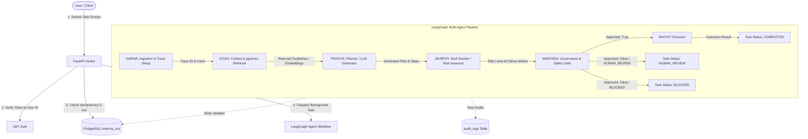
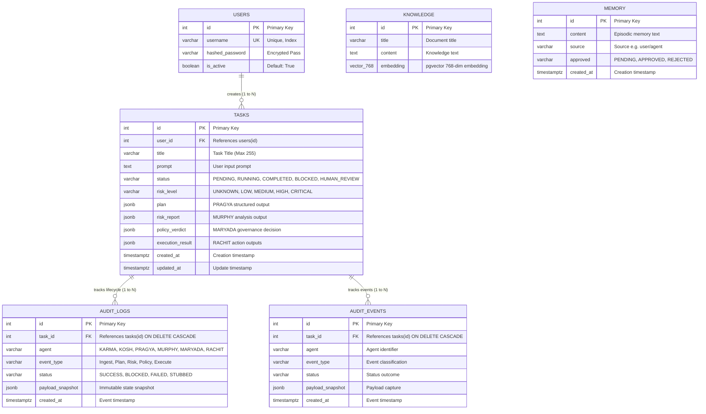

# BRAHMA COS — Architecture, State & Database Documentation
**Status Snapshot & Complete Technical Specification**
*Generated: September 2026*

---

## 1. Executive Summary: Kya Hua Hai & Kya Baki Hai

### ✅ Kya Hua Hai (Completed & Fully Verified)
1. **Infrastructure & Vector Database**:
   - Docker container `brahma-postgres` (`pgvector/pgvector:pg17`) running on port `5433`.
   - PostgreSQL schema with tables: `users`, `tasks`, `knowledge`, `memory`, `audit_logs`, `audit_events`.
   - `pgvector` extension enabled and active with 768-dimension vector search verified (`test_kosh.py`).
2. **Centralized LLM Integration**:
   - OpenRouter connectivity via LiteLLM using `openai/gpt-oss-20b` verified and active (`test_llm.py`).
3. **Multi-Agent State Orchestration (LangGraph)**:
   - **KARMA** (Ingest Intent & Trace ID generation).
   - **KOSH** (Context retrieval from vector knowledge base).
   - **PRAGYA** (Cognitive Planning via Centralized LLM).
   - **MURPHY** (Adversarial Red-Teaming, Failure Mode Analysis, Risk Tiering).
   - **MARYADA** (Policy Governance, Enforcement, Human-Review Triggers, Hard Blocking).
   - **RACHIT** (Execution Engine — safeguarded, verified in stubbed mode).
4. **Backend API (FastAPI + Uvicorn)**:
   - Running live on `http://127.0.0.1:8000`.
   - JWT authentication (`/auth/login`, `/auth/register`).
   - Task creation & background execution (`/tasks/`).
   - Immutable audit ledger endpoint (`/api/audit`).
   - Multi-tenant tenant data isolation (`user_id` checks).
   - 5-minute prompt idempotency & rate-limiting (HTTP 429).
5. **End-to-End Integration Verification**:
   - `test_integration.py` successfully validates both benign (escalated/reviewed) and critical (blocked) execution paths.

---

### ⏳ Kya Baki Hai (Pending Work & Roadmap)
1. **Frontend Integration**:
   - React/Vite web UI connection to FastAPI endpoints (`/auth`, `/tasks`, `/api/audit`).
   - Real-time agent progress visualization (WebSocket or polling).
2. **Human-in-the-Loop (HITL) Approval System**:
   - Interactive endpoint (`POST /tasks/{id}/approve` or `reject`) allowing human operators to clear tasks flagged as `HUMAN_REVIEW` by Maryada.
3. **RACHIT Real Execution Sandbox**:
   - Transitioning RACHIT from `RACHIT_STUBBED` to safe, sandboxed execution (e.g. isolated Docker runner or restricted API dispatcher).
4. **SMRITI Memory Consolidation**:
   - Automated reflection pipeline saving episodic task outcomes into `memory` table for future planning context.
5. **NIYANTRA & LISA**:
   - **NIYANTRA**: Real-time control plane to pause, cancel, or re-route live LangGraph execution.
   - **LISA**: Analytics dashboard for token consumption, LLM latency, security violation rates, and SLA compliance.

---

## 2. Multi-Agent Architecture & Flow Diagram

---

## 3. Database Deep-Dive & Complete Clarification

The database is **PostgreSQL 17** running in Docker (`brahma-postgres`), mapped to local port **5433** with the database name `brahma_cos`.

### Entity Relationship (ER) Diagram

---

### Detailed Table Specifications

#### 1. `users` Table
- **Purpose**: Centralized authentication, user management, and multi-tenant security boundary.
- **Fields**:
  - `id` (`INTEGER`, Primary Key, Auto-increment)
  - `username` (`VARCHAR`, Unique, Indexed, Non-null)
  - `hashed_password` (`VARCHAR`, Non-null)
  - `is_active` (`BOOLEAN`, Default: `True`)

#### 2. `tasks` Table
- **Purpose**: Core operational state ledger. Represents every user request and stores the intermediate outputs of all agents throughout the workflow.
- **Fields**:
  - `id` (`INTEGER`, Primary Key, Auto-increment)
  - `user_id` (`INTEGER`, Foreign Key referencing `users.id`, Indexed)
  - `title` (`VARCHAR(255)`, Non-null)
  - `prompt` (`TEXT`, Non-null)
  - `status` (`VARCHAR(50)`, Default: `'PENDING'`) — Values: `PENDING`, `RUNNING`, `COMPLETED`, `BLOCKED`, `HUMAN_REVIEW`, `FAILED`.
  - `risk_level` (`VARCHAR(20)`, Default: `'LOW'`) — Values: `LOW`, `MEDIUM`, `HIGH`, `CRITICAL`.
  - `plan` (`JSONB`, Nullable) — Output from **PRAGYA** (summary, steps, target systems).
  - `risk_report` (`JSONB`, Nullable) — Output from **MURPHY** (risk score, failure modes, blast radius).
  - `policy_verdict` (`JSONB`, Nullable) — Output from **MARYADA** (approved boolean, required mitigations, human escalation requirement).
  - `execution_result` (`JSONB`, Nullable) — Output from **RACHIT** (simulated or real action result).
  - `created_at` (`TIMESTAMPTZ`, Default: `NOW()`)
  - `updated_at` (`TIMESTAMPTZ`, Auto-updates on modification)

#### 3. `audit_logs` Table
- **Purpose**: Append-only, immutable security audit trail. Required for compliance, threat analysis, and zero-trust verification.
- **Fields**:
  - `id` (`INTEGER`, Primary Key, Auto-increment)
  - `task_id` (`INTEGER`, Foreign Key referencing `tasks.id` with `ON DELETE CASCADE`)
  - `agent` (`VARCHAR`) — E.g., `KARMA`, `KOSH`, `PRAGYA`, `MURPHY`, `MARYADA`, `RACHIT`, `SYSTEM`.
  - `event_type` (`VARCHAR`) — E.g., `Ingest Intent`, `Context Retrieval`, `Plan Generation`, `Risk Assessment`, `Policy Enforcement`, `Task Execution`, `Workflow Crash`.
  - `status` (`VARCHAR`, Default: `'SUCCESS'`) — E.g., `SUCCESS`, `BLOCKED`, `FAILED`, `STUBBED`.
  - `payload_snapshot` (`JSONB`, Nullable) — Exact parameters/results recorded at the moment of execution.
  - `created_at` (`TIMESTAMPTZ`, Default: `NOW()`)

#### 4. `knowledge` Table (KOSH Vector Store)
- **Purpose**: Semantic vector storage for enterprise policies, system documentation, and organizational guidelines.
- **Fields**:
  - `id` (`INTEGER`, Primary Key, Auto-increment)
  - `title` (`VARCHAR(255)`)
  - `content` (`TEXT`)
  - `embedding` (`VECTOR(768)`) — Vector column leveraging `pgvector` for cosine distance (`<=>`) queries.

#### 5. `memory` Table (SMRITI Core Store)
- **Purpose**: Long-term episodic memory for past agent executions, human feedback, and learned heuristics.
- **Fields**:
  - `id` (`INTEGER`, Primary Key, Auto-increment)
  - `content` (`TEXT`, Non-null)
  - `source` (`VARCHAR`, Default: `'user'`)
  - `approved` (`VARCHAR`, Default: `'PENDING'`) — Enforces Human-in-the-Loop review before memory is trusted.
  - `created_at` (`TIMESTAMPTZ`, Default: `NOW()`)

---

## 4. Agent Responsibility Matrix

| Agent | Responsibility | Primary Input | Stored Output (in `tasks`) | Audit Entry (`audit_logs`) |
| :--- | :--- | :--- | :--- | :--- |
| **KARMA** | Ingestion & Trace Setup | Raw user prompt | Initial state (`trace_id`, `intent`) | `Ingest Intent` |
| **KOSH** | Context Retrieval | Intent embedding | Retrieved documents (`context`) | `Context Retrieval` |
| **PRAGYA** | Cognitive Planner | Context + Intent | `plan` (JSON) | `Plan Generation` |
| **MURPHY** | Adversarial Red-Teamer | `plan` + Intent | `risk_report` (JSON) | `Risk Assessment` |
| **MARYADA** | Governance & Policy Gate | `plan` + `risk_report` | `policy_verdict` (JSON) | `Policy Enforcement` |
| **RACHIT** | Executor | `policy_verdict` approval | `execution_result` (JSON) | `Task Execution` |

---

## 5. Summary of System Health & Stability

- **PostgreSQL / pgvector**: 🟢 Healthy (Port 5433)
- **OpenRouter LLM Connectivity**: 🟢 Healthy (`openai/gpt-oss-20b`)
- **FastAPI / Uvicorn Server**: 🟢 Healthy (Port 8000, PID 340)
- **Integration Tests**: 🟢 100% Passing (`test_integration.py`)
- **Security Protections**: 🟢 Multi-tenant isolation, idempotency check, immutable audit logging active
